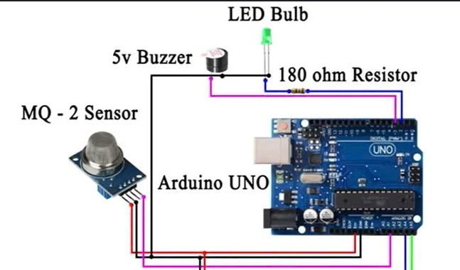
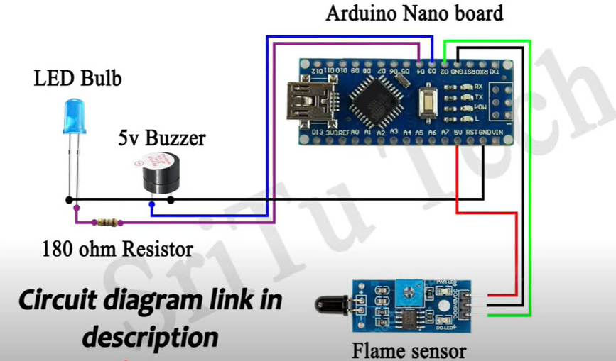
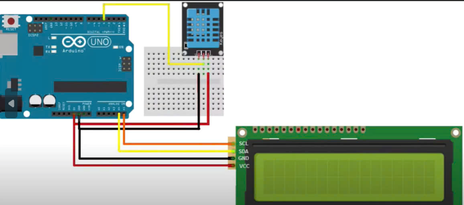
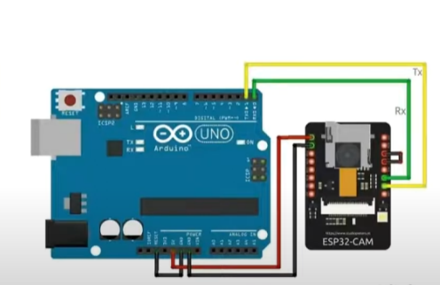
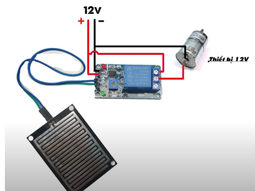
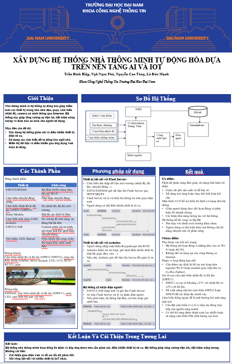

<h1 align="center">Hệ thống nhà thông minh

 </h1>

  
  

<h2 align="center">Nhà thông minh cùng các cảm biến</h2>

## 🌟 Giới thiệu

 Dự án này sử dụng các cảm biến như esp32 cam , dht11, led lcd, mq2 sensor, flame sensor,... để tạo ra 1 hệ thống nhà thông minh hoàn chỉnh.

🚀 Chức năng chính

---
- **⚡ Cảm biến lửa theo thời gian thực
- **🤖 Sử dụng ai nhận dạng khuôn mặt theo thời gian thực
- **⚡ Cảm biến khí gas
- **⚡ Cảm biến mưa
- **⚡ cảm biến nhiệt độ , độ ẩm

--

## 🛠️ Yêu cầu hệ thống

### 🔌 Phần cứng
- **ESP32Cam**: Camera nhận diện khuôn mặt

- **MQ-2**: Cảm biến khí gas

- **còi**: còi báo

- **Flame sensor**: Cảm biến báo lửa

- **DHT11**: Cảm biến đo nhiệt độ , độ ẩm trong nhà

- **Led LCD**: hiển thị nhiệt độ , độ ẩm lên màn hình

- **Cảm biến mưa**: Cảm biến thông báo khi có mưa

### 💻 Phần mềm
- **🐍 Python 3+**: code nhận diện khuôn mặt
- **⚡ Arduino IDE** :để nạp code lên board .

### 📦 Các thư viện Python cần thiết
Cài đặt các thư viện bằng lệnh:

    pip install flask numpy matplotlib cv2 face_recognition requests
## 🧮 Bảng mạch

### khí gas

## lửa

## Nhiệt độ

## Camera

## Mưa

## 🚀 Hướng dẫn cài đặt và chạy
1️⃣ Chuẩn bị phần cứng
- **Nạp mã Arduino**:

    1. Mở file trong folder "nhom8" hoặc các file trên github bằng Arduino IDE.
    2. Kết nối các board với máy tính.
    3. Đảm bảo các board xuất hiện trên cổng COM3 bằng dây kết nối.
    4. Kiểm tra và điều chỉnh ssid, password và serverHost sao cho phù hợp với mạng WiFi và server của bạn.
    5. Nạp mã vào các board .
    

2️⃣ Cài đặt thư viện Python. 

Cài đặt Python 3 nếu chưa có, sau đó cài đặt các thư viện cần thiết bằng pip.

4️⃣ Chạy các chương trình

Để đảm bảo hệ thống hoạt động đúng cách, bạn cần khởi chạy cammera trên arduino trước. Sau khi thấy console thông báo đã kết nối cam thành công và hiện link của host thì nhấn vào và bật cam lên sau đó vào "nhandienkhuonmat.py" và chạy code

✅ Chạy ứng dụng chính (`nhandienkhuonmat.py`):

    python nhandienkhuonmat.py
- Ứng dụng sẽ:

    - Khởi tạo server nhận diện khuôn mặt , tự capture 1 tấm ảnh để đối chiếu với database mat_chu_nha

## 📖 Hướng dẫn sử dụng
1️⃣ Bắt đầu thực hiện

hãy chạy hết các code arduino 

## ⚙️ Cấu hình & Ghi chú

1. ESP32cam: 
- Với mỗi mô trường khác nhau, ta phải cấu hình lại các chỉ số ssid, password và serverHost cho phù hợp.
2. Server host:
- Hãy nhớ cho server Host chạy mọi lúc trong lúc thực hiện để có thể nhận dữ liệu từ esp32 cam liên tục.
3. Khi thực hiện: 
- Hãy đảm bảo ESP32cam được cấp nguồn liên tục trong quá trình thực hiện để có thể gửi dữ liệu liên tục tới server 
- Hãy cho các code arduino từ các cảm biến đều chạy để xem kết quả

## 📰 Poster

  

## 🤝 Đóng góp
Dự án được phát triển bởi 4 thành viên:

| Họ và Tên       | Vai trò                  |
|-----------------|--------------------------|
| Nguyễn Cao Tùng | Biên soạn tài liệu Overleaf, Phát triển mã nguồn, thiết kế sơ đồ lắp đặt, kiểm thử, triển khai dự án, thuyết trình triển khai video .|
| Ngô Ngọc Phú | Biên soạn Báo cáo, thiết kế slide PowerPoint ,Phát triển mã nguồn, thiết kế sơ đồ lắp đặt, kiểm thử, triển khai dự án.|
| Trân Đình Hiệp    |  Thiết kế poster, hỗ trợ bài tập lớn.  |
| Lò Đức Mạnh     | Hỗ trợ bài tập lớn,      |

© 2025 NHÓM 8, CNTT16-03, TRƯỜNG ĐẠI HỌC ĐẠI NAM
